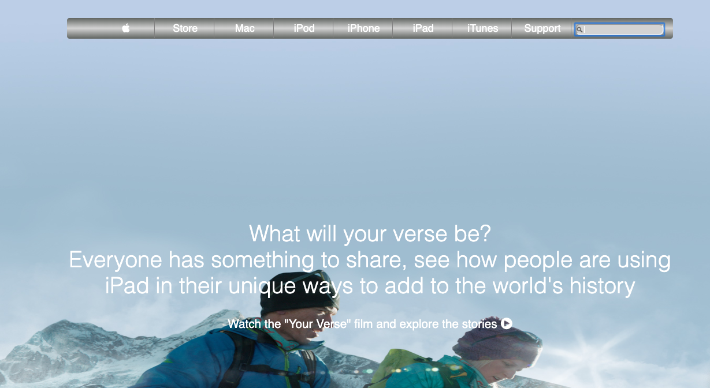

# Apple Website Webpage clone
> Project based on a clone of one of the Apple.com website webpages

## Built With

- CSS and HTML
- Float
- Box Model
- CSS Grid

## Live Demo

[Click here](https://rawcdn.githack.com/Elbie-em/Apple_website_webpage_clone/d060f721905a802c675a9a94ef9772c94f27c2f2/index.html) for live demo

## Getting Started

**This is a static page and was made using  CSS & HTML, you don't need .**
**anything to start up this page, it is already published in a public repository so you can check the final result.**

## Author

👤 **Elbie Moonga**

- GitHub: [@Elbie-Em](https://github.com/Elbie-em)
- Twitter: [ElbieEm](https://twitter.com/ElbieEm)
- LinkedIn: [elbie-moonga](https://www.linkedin.com/in/elbie-moonga-253bbb12b/)

## 🤝 Contributing

Contributions, issues and feature requests are welcome!

## Show your support

Give a ⭐️ if you like this project!

## 📝 License

This project is [MIT](lic.url) licensed.
